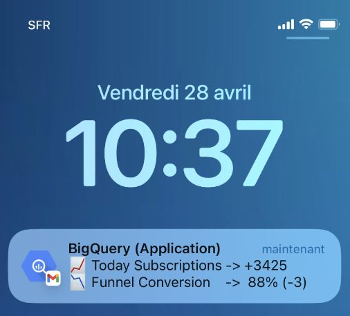
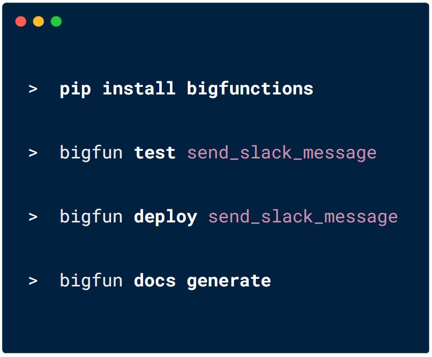
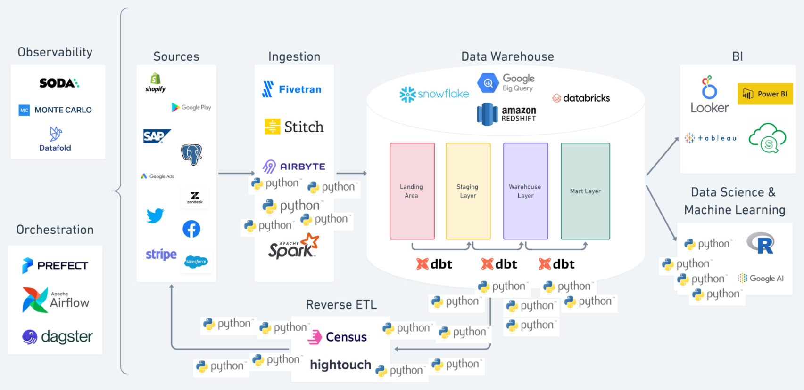

SQL
{ .big-word }

# is all you need

Supercharge **BigQuery** with **BigFunctions** 
*to load, transform and activate your data.*  

[Book a Demo :octicons-arrow-right-24:](https://calendar.app.google/zu54nNMHLVw7jYWy8){ .md-button .md-button--primary }

<!------------- TECHNOLOGIES UPON SECTION  ----------->

*Taking the most of*
{ .small }

<figure markdown="span">
  { .gray-scale .mt-neg width=200 }
</figure>

---

<!------------- POWER OF FUNCTIONS HEADER  ----------->

# Supercharge your BigQuery with public functions

150+ functions available from your BigQuery project

*no install needed*
{ .small }

[Explore Public Functions :octicons-arrow-right-24:](bigfunctions/){ .md-button }

-   ## 1. Load

    Load data with one SQL command from:

    - any SAAS such as Salesforce, Hubspot, Zendesk, etc.
    - external data such as `exchange_rate`, weather data.
    - any source

-   { .primary-border }

-   ## 2. Transform

    Make Advanced Transforms from SQL.

    Benefit from the functions of the community.

-   { .primary-border }

-   ## 3. Activate

    Send Slack, Google Chat, Teams messages or emails to your teams.

    Send the figures of the week or alerts when data is wrong.

    With dbt post hook, you can trigger activations at model creation.

-   { .primary-border }

 

---

<!------------- FRAMEWORK  ----------->

# Deploy Functions in your BigQuery Project

Deploy public functions (or your own) in your BigQuery project with the Command-Line Interface.

[Discover the Framework :octicons-arrow-right-24:](framework/){ .md-button }

-   ## A YAML Standard

    Each function is defined in a yaml file which defines the:

    - author
    - description
    - arguments
    - examples
    - code

     

    Yaml files are:

    - used for deploying and generating the documentation website.
    - easily shared
    - open: public functions yaml files are all open-source and downloadable with one command.

-   

-   ## Command Line Interface

    `bigfun` CLI is installable with one `pip install` and enables you to:

    - get the yaml file of a public function
    - test the function
    - deploy it
    - generate a documentation website (such as this website)

-   

 

---

<!------------- THE RISE OF SQL DATA STACK  ----------->

# Simplify your Stack with the SQL-Data-Stack

**BigQuery**, **BigFunctions** and **dbt** 
is all you need

-   **BigQuery** runs SQL

    { style="max-height: 50px" }

-   **BigFunctions** supercharges SQL

    { style="max-height: 50px" }

-   **dbt** orchestrates SQL

    { style="max-height: 50px" }

**dbt can be replaced by any sql orchestrator (dataform, sqlmesh, scheduled queries, etc)*
{ .small }

-   ## Modern-Data-Stack

    

    :x: **Tool Sprawl**: A multitude of tools for various tasks complicates the data workflow.

    :x: **Custom Scripting**: Reliance on custom Python scripts introduces complexity and increases maintenance overhead.

    :x: **Lack of Self-Service**: Data analysts often depend on data engineers for complex tasks, hindering agility and efficiency.

-   ## SQL-Data-Stack

    

    :white_check_mark: **Simplicity**: Achieve everything with SQL, thus minimizing the need for multiple tools.

    :white_check_mark: **Centralized Governance**: Control all data processes from a central data warehouse with declarative assets.

    :white_check_mark: **Self-Service**:  Empower data analysts to perform intricate tasks using SQL functions directly.

 

---

<!------------- Get Started!  ----------->

# Get Started today!

As easy as a copy & paste.

-   :material-clock-fast:{ .lg .middle } __Call Public BigFunctions__

    ---

    Run public functions directly from your BigQuery project without installation.

    [Explore Public BigFunctions :octicons-arrow-right-24:](bigfunctions)

-   :material-rocket-launch:{ .lg .middle } __Deploy BigFunctions__

    ---

    Deploy functions in your GCP project using the Command-Line Interface.

    [Discover the Framework :octicons-arrow-right-24:](framework)

-   :fontawesome-solid-people-group:{ .lg .middle } __Join the Community__

    ---

    Benefit from BigFunctions community to get support or help others.

    [Join the Community :octicons-arrow-right-24:](CONTRIBUTING)

 
 

---

 

## BigFunctions: the key enabler of the SQL Data Stack

**BigFunctions** is a framework and a collection of open-source functions that make the SQL data stack a reality. It allows you to build a governed catalog of powerful BigQuery functions within your company.

*   **Governed Catalog**: A framework to build a governed catalog of powerful BigQuery functions.
*   **100+ Ready-to-Use Functions**: Provides more than 100 open-source functions for direct use in BigQuery.
*   **Comprehensive Functionality**: Includes functions for loading, transforming, and activating data.
*   **Community-Driven**: Leverages community-developed functions, and allows contributions.
*   **Familiar Workflow**:  Uses a YAML standard and CLI similar to dbt, making it intuitive for dbt users.

#### Benefits for Different Users:

*   **Data Analysts**: Gain new capabilities for loading data from diverse sources or activating data via reverse ETL and leverage a catalog of self-service functions.
*   **Analytics Engineers**: The framework's design is familiar to those who use dbt.
*   **Data Engineers**: Implement software engineering best practices and leverage community-developed functions, preventing the need to reinvent the wheel.
*   **Central Data Teams**: Provide a governed catalog of curated functions to large organizations with maintainable effort.
