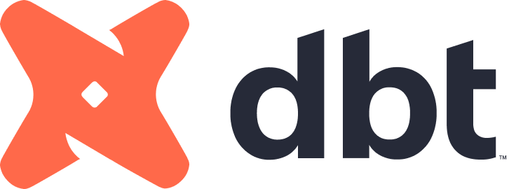
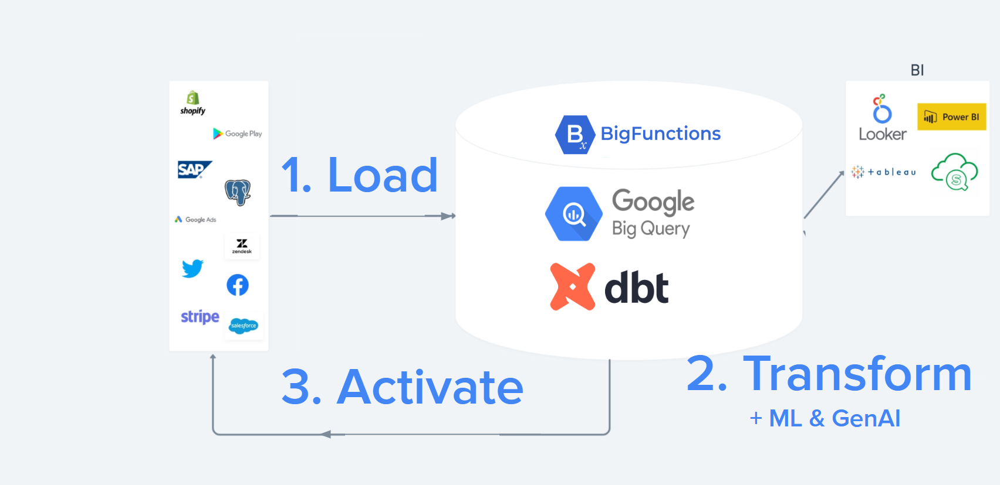
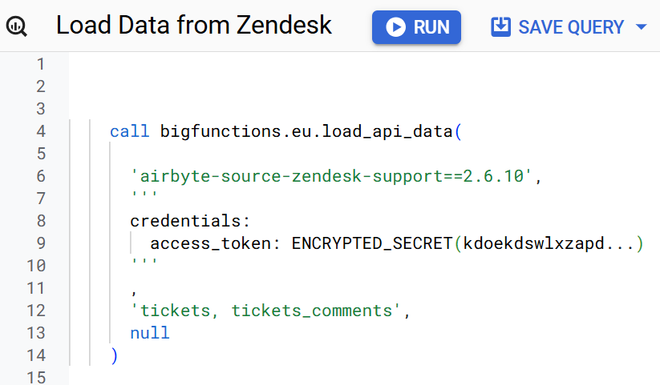
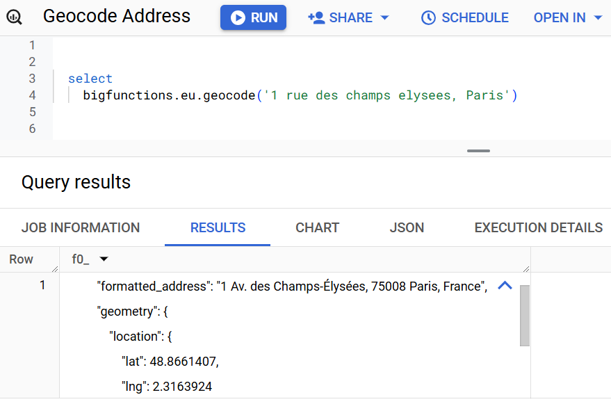
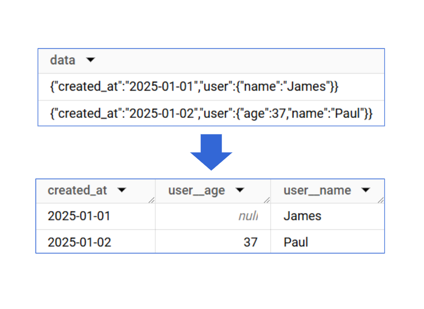
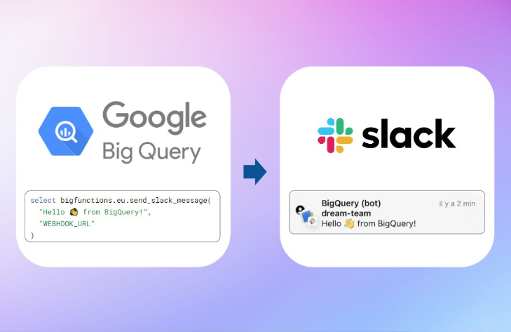

SQL
{ .big-word }

# is all you need

Supercharge **BigQuery** with **BigFunctions** 
*to load, transform and activate your data.*  

[Book a Demo :octicons-arrow-right-24:](https://calendar.app.google/zu54nNMHLVw7jYWy8){ .md-button .md-button--primary }

<!------------- TECHNOLOGIES UPON SECTION  ----------->

*Taking the most of*
{ .small }

<figure markdown="span">
  { .gray-scale .mt-neg width=200 }
</figure>

 

---

<!------------- THE RISE OF SQL DATA STACK  ----------->

# The rise of   the SQL-Data-Stack

**BigQuery**, **BigFunctions** and **dbt** 
make a SQL-Data-Stack

-   **BigQuery** runs SQL

    { style="max-height: 50px" }

-   **BigFunctions** supercharges SQL

    { style="max-height: 50px" }

-   **dbt** orchestrates SQL

    { style="max-height: 50px" }

**dbt can be replaced by any sql orchestrator (dataform, sqlmesh, scheduled queries, etc)*
{ .small }

-   ## Modern-Data-Stack

    

    :x: **Tool Sprawl**: A multitude of tools for various tasks complicates the data workflow.

    :x: **Custom Scripting**: Reliance on custom Python scripts introduces complexity and increases maintenance overhead.

    :x: **Lack of Self-Service**: Data analysts often depend on data engineers for complex tasks, hindering agility and efficiency.

-   ## SQL-Data-Stack

    

    :white_check_mark: **Simplicity**: Achieve everything with SQL, thus minimizing the need for multiple tools.

    :white_check_mark: **Centralized Governance**: Control all data processes from a central data warehouse with declarative assets.

    :white_check_mark: **Self-Service**:  Empower data analysts to perform intricate tasks using SQL functions directly.

<!------------- RISE OF SQL FOOTER  ----------->

### Powerfully simple

*BigFunctions supercharges BigQuery* 
*to run any task with SQL*

 

---

<!------------- POWER OF FUNCTIONS HEADER  ----------->

# The power of functions with the ease of SQL

Ready-to-use BigQuery functions to load, transform and activate data

*no install needed*
{ .small }

[Explore Functions :octicons-arrow-right-24:](bigfunctions/){ .md-button }

<!------------- LOAD FUNCTIONS  ----------->

### 1. LOAD Examples

-   ## Load Data from any SAAS

    Load data from Salesforce, Hubspot and hundreds of SAAS with one SQL command.

    [Get Started :octicons-arrow-right-24:](bigfunctions/load_api_data/){ .md-button }

-   { .primary-border }

-   ## Load External Data for Enrichment

    Get current and historical `exchange rates`, `weather` or any specific API data to enrich yours.

    [Get Started :octicons-arrow-right-24:](bigfunctions/exchange_rate/){ .md-button }

-   { .primary-border }

<!------------- TRANSFORM FUNCTIONS  ----------->

### 2. TRANSFORM Examples

-   ## Make Advanced Transforms

    With BigFunctions, you can do anything in SQL that you can do in python.
    You can for instance convert an `address` to `(latitude, longitude)`
    or get the `country` of an `ip_address`.

    All your transforms are now done in SQL.

    Put them all in dbt!

    [Get Started :octicons-arrow-right-24:](bigfunctions/geocode/){ .md-button }

-   { .primary-border }

-   ## Automatically Flatten Json

    Json data may be hard to manipulate.
    BigFunctions provide some functions to help with that.

    For instance, a function automatically detects json objects schema
    and generate a parsing SQL query to flatten the json column.

    [Get Started :octicons-arrow-right-24:](bigfunctions/sql_to_flatten_json_column/){ .md-button }

-   { .primary-border }

<!------------- ACTIVATE FUNCTIONS  ----------->

### 3. ACTIVATE Examples

-   ## Send Chat Message

    Send Slack, Google Chat or Teams message to your teams with the figures of the week.

    Or alert them when something is wrong.

    *It works in SQL, so it works with your SQL orchestrator (be it dbt, sqlmesh, dataform or scheduled queries)*.

    [Get Started :octicons-arrow-right-24:](bigfunctions/send_slack_message/){ .md-button }

-   { .primary-border }

-   ## Send Emails

    Send emails to your teams.

    Better, send emails to your customers!

    Your data-warehouse is the only place where you have a 360° view of your customer.

    So sending email from BigQuery makes a lot of sense.

    [Get Started :octicons-arrow-right-24:](bigfunctions/send_mail/){ .md-button }

-   { .primary-border }

<!------------- POWER OF FUNCTIONS FOOTER  ----------->

### Load, Transform, Activate

*BigFunctions comes with [150+ ready to use functions](bigfunctions/)*

*no install needed*
{ .small }

[Explore Functions :octicons-arrow-right-24:](bigfunctions/){ .md-button }

 

---

<!------------- FRAMEWORK  ----------->

# A framework like dbt

Build a Governed Catalog of BigQuery Functions at your Company

 

---

<!------------- Get Started!  ----------->

# Get Started today!

As easy as a copy & paste.

-   :material-clock-fast:{ .lg .middle } __Call Public BigFunctions__

    ---

    Run public functions directly from your BigQuery project without installation.

    [Explore Public BigFunctions :octicons-arrow-right-24:](bigfunctions)

-   :material-rocket-launch:{ .lg .middle } __Deploy BigFunctions__

    ---

    Deploy functions in your GCP project using the Command-Line Interface.

    [Discover the Framework :octicons-arrow-right-24:](framework)

-   :fontawesome-solid-people-group:{ .lg .middle } __Join the Community__

    ---

    Benefit from BigFunctions community to get support or help others.

    [Join the Community :octicons-arrow-right-24:](CONTRIBUTING)

 
 

---

 

## BigFunctions: the key enabler of the SQL Data Stack

!!! note ""

    **BigFunctions** is a framework and a collection of open-source functions that make the SQL data stack a reality. It allows you to build a governed catalog of powerful BigQuery functions within your company.

    *   **Governed Catalog**: A framework to build a governed catalog of powerful BigQuery functions.
    *   **100+ Ready-to-Use Functions**: Provides more than 100 open-source functions for direct use in BigQuery.
    *   **Comprehensive Functionality**: Includes functions for loading, transforming, and activating data.
    *   **Community-Driven**: Leverages community-developed functions, and allows contributions.
    *   **Familiar Workflow**:  Uses a YAML standard and CLI similar to dbt, making it intuitive for dbt users.

    #### Benefits for Different Users:

    *   **Data Analysts**: Gain new capabilities for loading data from diverse sources or activating data via reverse ETL and leverage a catalog of self-service functions.
    *   **Analytics Engineers**: The framework's design is familiar to those who use dbt.
    *   **Data Engineers**: Implement software engineering best practices and leverage community-developed functions, preventing the need to reinvent the wheel.
    *   **Central Data Teams**: Provide a governed catalog of curated functions to large organizations with maintainable effort.
